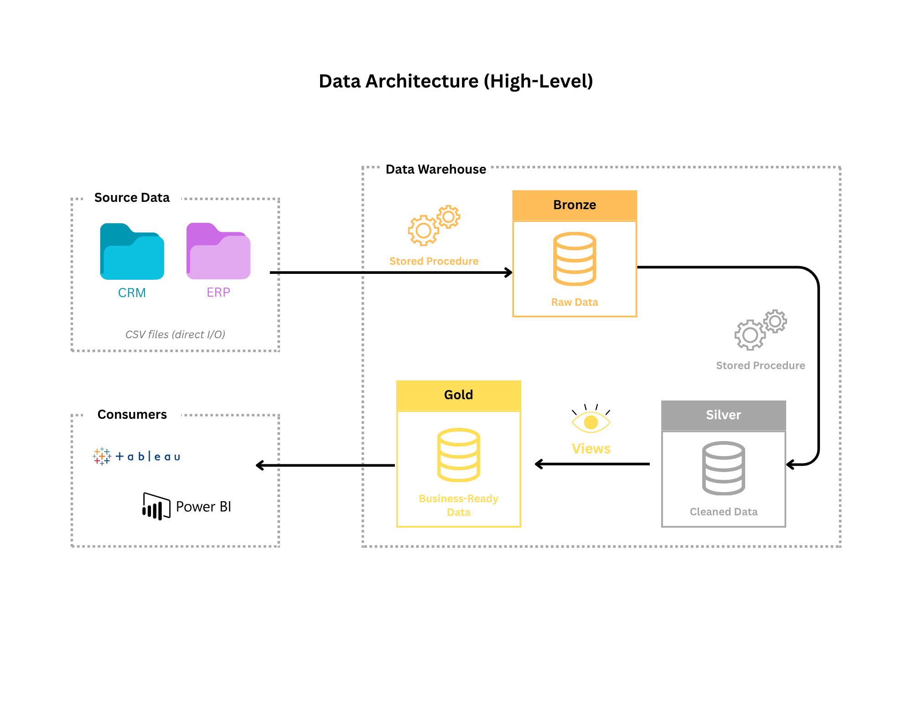
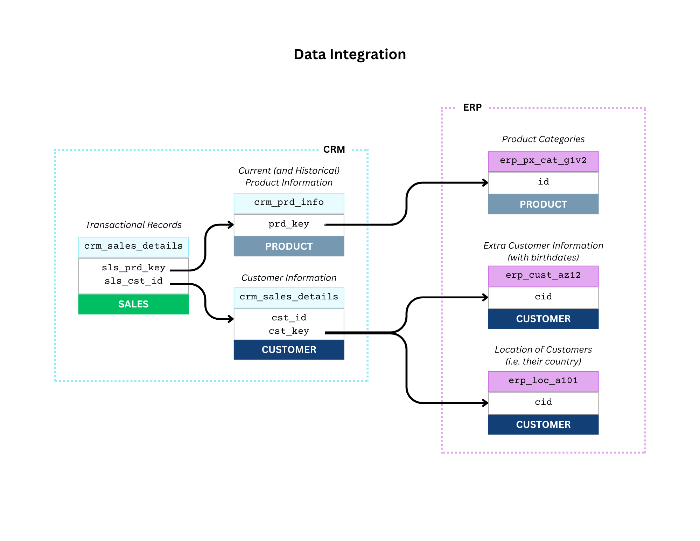
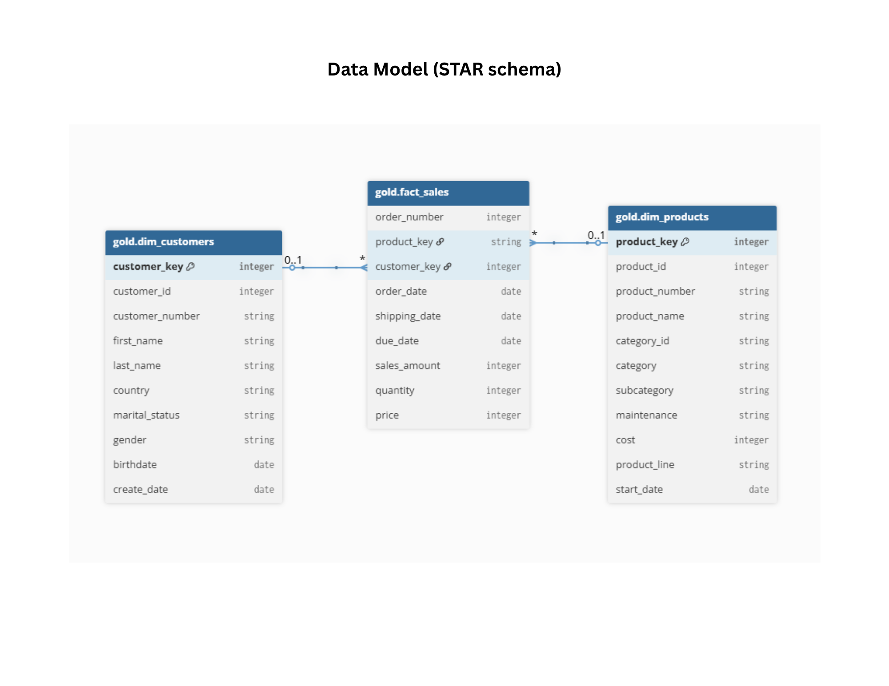

# Data Warehouse Project

This project aims to demonstrate relevant data warehousing skills. It involves a simple dataset (CSV formats) which includes dummy export data as would be sourced from an ERP and a CRM. It aims to highlight relevant data engineering skills and industry best practices.

<br/>

## **Table of Contents**

1. [Reproduce Database Locally](#reproduce-database-locally)
1. [Naming Conventions](#naming-conventions)
1. [Data Sources](#data-sources)
1. [Data Architecture](#data-architecture)
1. [Data Integration](#data-integration)
1. [Data Flow](#data-flow)
1. [Data Modeling](#data-modeling)
1. [Data Catalog](#data-catalog)
1. [Notes](#notes)

---

<br/>

### Reproduce Database Locally

In order to reproduce the entire database state to inspect on your local machine, you can follow this simple guide.

1. Clone this repository on your local machine

   > Note: You can also just download the database backup file found [here](import/DataWarehouse.bak).

   ```bash
   git clone https://github.com/TheSandSmith/portfolio-data-warehouse.git
   ```

2. Navigate to the directory where you have your SQL Server installation

   > On Windows, it is typically under `C:\Program Files\Microsoft SQL Server\`

3. Navigate to `MSSQL16.MSSQLSERVER\MSSQL\Backup`
4. Copy the backup file from the cloned repository (found under `import/DataWarehouse.bak`) and place it in the Backup directory.
5. Go to SQL Server Management Studio
6. In the project explorer on the left, right-click on `Databases` and choose `Restore Databases`.
7. Choose `Device` and browse to locate the `DataWarehouse.bak` file.
8. Click `Ok` and you should now have the entire database ready to inspect.

<br/>

### Naming Conventions

To ensure consistent structuring and better maintainability, certain naming conventions were followed throughout the project. You can consult more in detail [here](docs/__naming_conventions.md).

<br/>

### Data Sources

For simplicity, this project only gets its source data from a few CSV dummy data as would be exported from a CRM and an ERP system.

CRM Dummy Data:

- customer info ([cust_info.csv](datasets/source_crm/cust_info.csv))
- product info ([prd_info.csv](datasets/source_crm/prd_info.csv))
- sales info ([sales_details.csv](datasets/source_crmsales_details.csv))

ERP Dummy Data:

- extra customer info ([CUST_AZ12.csv](datasets/source_erp/CUST_AZ12.csv))
- customer location info ([LOC_A101.csv](datasets/source_erp/LOC_A101.csv))
- product category info ([PX_CAT_G1V2.csv](datasets/source_erp/PX_CAT_G1V2.csv))

<br/>

### Data Architecture

This data warehouse is set up following the medalion method (i.e. bronze, silver, gold layers).

Typically, the layers are differentiated as follows:

- BRONZE: holds the source data as-is
- SILVER: holds a "cleaned/processed" subset of the data in the bronze layer
- GOLD: consists of multiple "views" into the silver layer, arranged into a STAR structure of dimension and fact virtual tables



<br/>

### Data Integration

The source data is split between customer data, product data, and sales data. Here is a diagram showing how the tables are related.



<br/>

### Data Flow

The data gets loaded from source into the bronze layer through a stored procedure.

A similar approach is implemented to load data into the silver layer.

Finally, the gold layer does not get any "loading", but rather consists of various "virtual tables" (i.e. views) into the silver layer's tables.


<br/>

### Data Modeling

The data model (the gold layer) follows a STAR structure whereby there is a single fact table (`sales`) and two dimension tables (`customers` and `products`).



<br/>

### Data Catalog

The gold layer (or business-ready consumable analytics data) is usually quite complex. Despite this project's analytics data only containing 3 virtual tables, a data catalog was still included, as would normally be provided for data consumers. Feel free to consult it [here](docs/_data_catalog.md).

<br/>

### Notes

Given that this is not a complex data system such as those deployed in actual businesses, however this project still succeeds at demonstrating foundational data engineering concepts and skills. That being said, here are some supplementary notes:

1. some datatypes were chosen for simplicity (e.g. prices being `int` instead of `float`)
2. source data was chosen to be flat CSV files which simulate dummy export data from a CRM and ERP source

<br/>

### License

This project is licensed under the [MIT License](LICENSE). You are free to use, modify, and share this project with proper attribution.

<br/>
<br/>

---

<h4><i>Acknowledgement</i></h4>

_This project is based on original work made available by Baraa Khatib Salkini in his Data Engineering tutorial on <a href="https://www.youtube.com/watch?v=SSKVgrwhzus">YouTube</a>. Modifications include updated stored procedure logic, introduction of helper user functions, and updated documentation._
